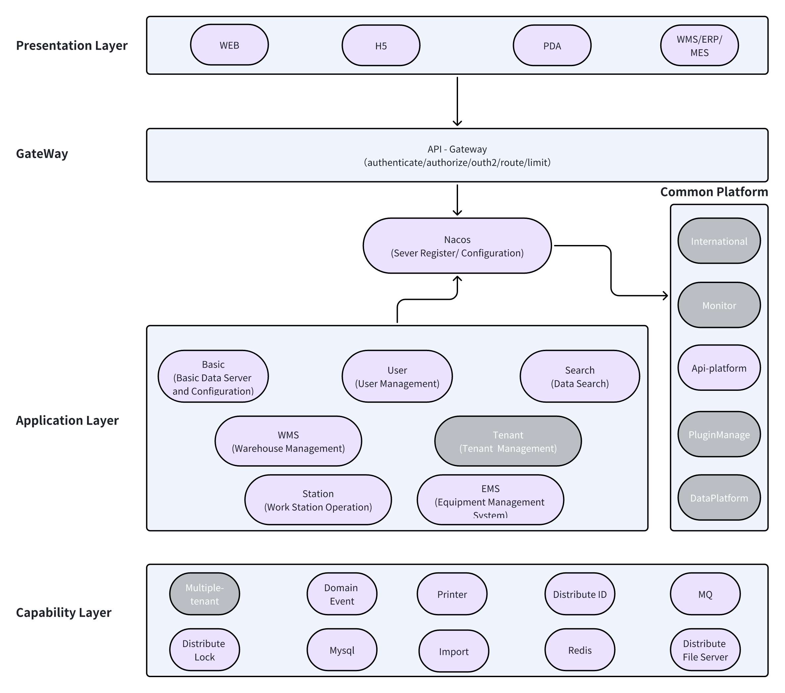

# Open Warehouse Execution System (WES)

[English](README.md) | [中文](README_CN.md)

**Open WES** is a customizable, open-source Warehouse Execution System designed to streamline warehouse operations. It
integrates seamlessly with various automation technologies, providing efficient workflow management, task scheduling,
and real-time data tracking.

## Features

- **Task Management**: Efficiently manage and prioritize tasks across warehouse operations.
- **Real-time Monitoring**: Get a live view of inventory, equipment, and workflows.
- **Modular Design**: Easily integrate with existing warehouse systems.
- **Customizable Rules**: Configure rules for task allocation, sorting, and routing.
- **Open API**: Interact with the system using RESTful or WebSocket APIs.

## Installation

### Prerequisites

- [Java](https://www.java.com/) (17+): For running the backend server applications.
- [MySQL](https://www.mysql.com/) (8.0+): Used as the relational database for storing warehouse data.
- [Nacos](https://nacos.io/) (2.0+): A service registry and configuration management tool.
- [Redis](https://redis.io/) (7.0+): Used for caching and session management.
- [Node.js](https://nodejs.org/)(18+): For running the client application.

> Mysql, Nacos and Redis should be installed on the same machine.

### Steps

1. Clone the repository:
   ```bash
   git clone https://github.com/jinsewu/openwes.git
   ```
2. Add nacos config through executing the scripts in the /script folder
3. Configure the hostname `nacos.openwes.com` by editing your hosts file (e.g., `/etc/hosts` on Linux or `C:\Windows\System32\drivers\etc\hosts` on Windows):  
   ```172.0.0.1 nacos.openwes.com```
4. Create database openwes
5. Start the servers: WesApplication, GatewayApplication and StationApplication located in the /server directory
6. Start the client: cd client and run npm install, then run npm start
7. input user/password: admin/12345

## Usage

The Open WES provides a user-friendly interface for managing your warehouse. You can perform tasks such as:

- **Adding New Products:** Easily add new products to your inventory, simplifying the process of introducing new items
  to your warehouse.

- **Managing Inventory Levels:** Effortlessly monitor and manage inventory levels to ensure optimal stock availability
  and prevent overstocking or understocking.

- **Supporting Full Warehouse Flows:** Open WES supports complete warehouse workflows, encompassing inbound processes (
  receiving), outbound processes (shipping), rechecking, packing, stocktaking, and inventory relocation. This
  comprehensive support ensures efficient and organized operations.

- **Generating Performance Reports:** Access detailed reports on warehouse performance, providing valuable insights into
  key metrics, such as inventory turnover, order fulfillment rates, and operational efficiency.

- **Supporting Operator and Robot Operations:** Open WES seamlessly accommodates both human and robot operations,
  promoting
  a flexible and efficient work environment. Warehouse staff can collaborate effectively with automated systems,
  optimizing productivity.

- **Easy Integration with WCS and RCS:** Open WES is designed for easy integration with Warehouse Control Systems (WCS)
  and
  Robot Control Systems (RCS). This streamlined connectivity allows for synchronized and efficient management of robotic
  systems within the warehouse environment.

For detailed instructions and examples, refer to our example [website](https://www.openwes.top/).

## Contributing

We welcome contributions from the community to help improve this project. To contribute:

1. Fork the repository.
2. Create a new branch for your feature or bug fix.
3. Make your changes and commit them.
4. Submit a pull request, detailing your changes and the problem they solve.

Please review our [Contribution Guidelines](CONTRIBUTING.md) for more information.

## License

This project is licensed under the [MIT License](LICENSE).

## Contact

If you have any questions or need assistance, feel free to reach out to us on
our [GitHub Issues](https://github.com/jingsewu/open-wes/issues) page.

Thank you for using and contributing to the Smart Warehouse Management System!

## Architecture
The architecture of Open WES is modular and scalable, designed to handle complex warehouse operations. Below is a high-level overview of its components:



## Getting Help

If you encounter issues or have questions, check out the following resources:
- [GitHub Issues](https://github.com/jingsewu/open-wes/issues): Report bugs or request features.
- [Documentation](./doc): Find detailed guides and API documentation.  
